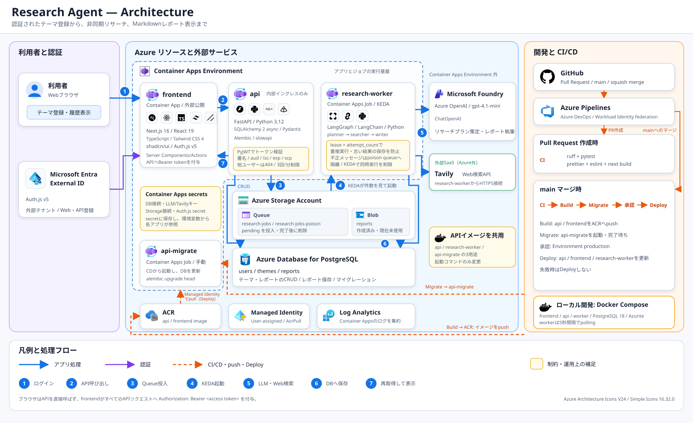

# Research Agent

調べたいテーマを登録すると、AIエージェントがWeb検索を行い、Markdown形式の調査レポートを作成するアプリです。リサーチは非同期で実行され、過去のレポートもテーマごとに確認できます。

## 主な機能

- Microsoft Entra External IDによるログイン
- テーマの登録・編集・削除
- AIエージェントによるWebリサーチとレポート生成
- テーマごとのレポート履歴と実行状況の表示
- ユーザー単位のデータ分離とリサーチ実行制限（暫定：1ユーザー1分あたり3回）

## アーキテクチャ



- ブラウザからの操作はNext.jsが受け、Server Components / Server Actionsから内部APIを呼び出し。
- FastAPIはアクセストークンとデータ所有者を検証し、リサーチ依頼をAzure Storage Queueへ登録。
- QueueをトリガーにContainer Apps Jobが起動し、LangGraph、Microsoft Foundry、Tavilyでレポートを生成。
- PostgreSQLに保存された結果をNext.jsが再取得して表示。

## 技術スタック

| 領域 | 主な技術 |
| --- | --- |
| frontend | Next.js 16、React 19、TypeScript、Tailwind CSS 4、shadcn/ui |
| 認証 | Auth.js v5、Microsoft Entra External ID |
| api | FastAPI、Python 3.12、SQLAlchemy 2（async）、Pydantic、Alembic、PostgreSQL |
| AI | LangGraph、LangChain、Microsoft Foundry（Azure OpenAI）、Tavily |
| インフラ | Azure Container Apps / Jobs、Storage Queue、Azure Container Registry、Managed Identity、Log Analytics、Bicep |
| CI/CD | GitHub、Azure Pipelines、Docker |

## リポジトリ構成

| パス | 内容 |
| --- | --- |
| `frontend/` | Next.jsフロントエンド |
| `api/` | FastAPI、worker、DBマイグレーション |
| `infra/` | AzureリソースのBicep定義  ※一部のみ。後日アップデート |
| `docs/` | アーキテクチャ図、ADR、ER図 |

## ローカルで動かす手順

```bash
cp .env.example .env
cp api/.env.example api/.env
cp frontend/.env.local.example frontend/.env.local
# api/.env と frontend/.env.local に必要な値を設定
make up
make migrate
```

フロントエンドは <http://localhost:3001>、Swagger UIは <http://localhost:8000/docs> で確認できます。詳しい準備と開発手順は[CONTRIBUTING.md](CONTRIBUTING.md)を参照してください。

## ドキュメント

- [開発者向けガイド](CONTRIBUTING.md)
- [設計判断の記録](docs/adr/) ※ 一部のみ。後日アップデート。
- [ER図](docs/er-diagram.md)
