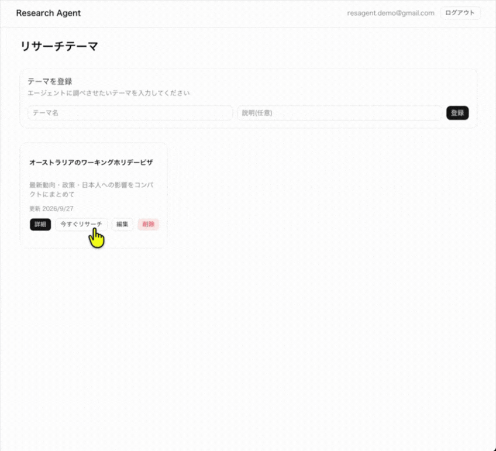
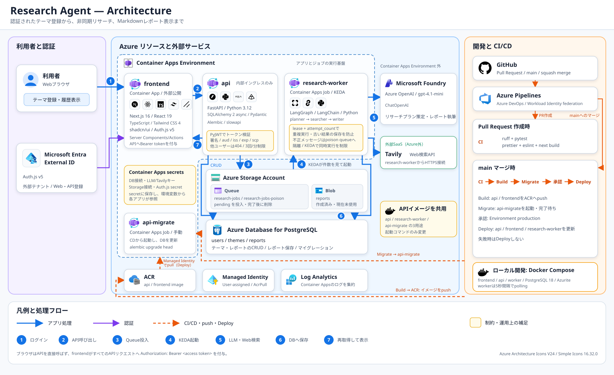

# Research Agent

登録したテーマについてAIエージェントがWeb検索を行い、Markdown形式の調査レポートを作成するアプリです。リサーチは非同期で実行され、過去のレポートもテーマごとに確認できます。

## デモ

| 項目 | 内容 |
| --- | --- |
| アプリURL | https://frontend.blackplant-f73482db.japaneast.azurecontainerapps.io |
| デモアカウント | メールアドレス：resagent.demo@gmail.com<br>パスワード：resagent-2026 |


> [!WARNING]
> デモアカウントは共有です。
> 登録したテーマやレポートはアカウントを共有している他の利用者にも表示されるため、**個人情報や機密情報は入力しないでください。**

 

※リサーチ実行中の時間は編集上カットしています。

## 要件

### 機能要件

| 機能 | 状態 |
| --- | --- |
| サインアップ・ログイン（Microsoft Entra External ID、メールとパスワード） | 実装済み |
| テーマの登録・一覧・編集・削除 | 実装済み |
| リサーチの手動実行（検索計画の策定 → Web検索 → レポート作成を非同期で実行） | 実装済み |
| リサーチ完了のトースト通知 | 実装済み |
| テーマごとのレポート一覧・詳細表示（Markdown） | 実装済み |
| ユーザー単位のデータ分離 | 実装済み |
| リサーチの実行回数制限（本番で合計200回まで & 1ユーザー1分あたり3回まで） | 実装済み |
| 定期（週次）リサーチの自動実行 | 今後追加予定 |
| 蓄積したレポートへのチャット質問（RAG、回答のストリーミング表示、会話履歴の保存） | 今後追加予定 |
| レポートのPDFダウンロード | 今後追加予定 |
| 週次レポートのメール配信 | 今後追加予定 |

### 非機能要件

| 観点 | 内容 | 状態 |
| --- | --- | --- |
| セキュリティ | アクセストークンの検証、他ユーザーのデータへのアクセス拒否、入力検証 | 実装済み |
| 秘密情報 | Container Appsのsecretで管理 | 実装済み |
|  | Key VaultとManaged Identityによるパスワードレス接続 | 今後追加予定 |
| CI/CD | PRごとの自動検査、mainマージでビルド → DBマイグレーション → 承認 → デプロイ | 実装済み |
| 監視 | Log Analyticsへのログ集約 | 実装済み |
|  | Application Insightsによるトレース・アラート | 今後追加予定 |
| IaC | Bicepで一部のリソースを定義 | 一部実装済み |

## アーキテクチャ



## 技術スタック

| 領域 | 主な技術 |
| --- | --- |
| frontend | Next.js 16、React 19、TypeScript、Tailwind CSS 4、shadcn/ui |
| 認証 | Auth.js v5、Microsoft Entra External ID |
| api | FastAPI、Python 3.12、SQLAlchemy 2（async）、Pydantic、Alembic、PostgreSQL |
| AI | LangGraph、LangChain、Microsoft Foundry（Azure OpenAI）、Tavily |
| インフラ | Azure Container Apps / Jobs、Storage Queue、Azure Container Registry、Managed Identity、Log Analytics、Bicep |
| CI/CD | GitHub、Azure Pipelines、Docker |

## リポジトリ構成

| パス | 内容 |
| --- | --- |
| `frontend/` | Next.jsフロントエンド |
| `api/` | FastAPI、worker、DBマイグレーション |
| `infra/` | AzureリソースのBicep定義  ※一部のみ。後日アップデート |
| `docs/` | アーキテクチャ図、ADR、ER図 |

## ローカルで動かす手順

```bash
cp .env.example .env
cp api/.env.example api/.env
cp frontend/.env.local.example frontend/.env.local
# api/.env と frontend/.env.local に必要な値を設定
make up
make migrate
```

フロントエンドは <http://localhost:3001>、Swagger UIは <http://localhost:8000/docs> で確認できます。詳しい準備と開発手順は[CONTRIBUTING.md](CONTRIBUTING.md)を参照してください。

## ドキュメント

- [開発者向けガイド](CONTRIBUTING.md)
- [ADR](docs/adr/) ※ 一部のみ。後日アップデート。
- [ER図](docs/er-diagram.md)
