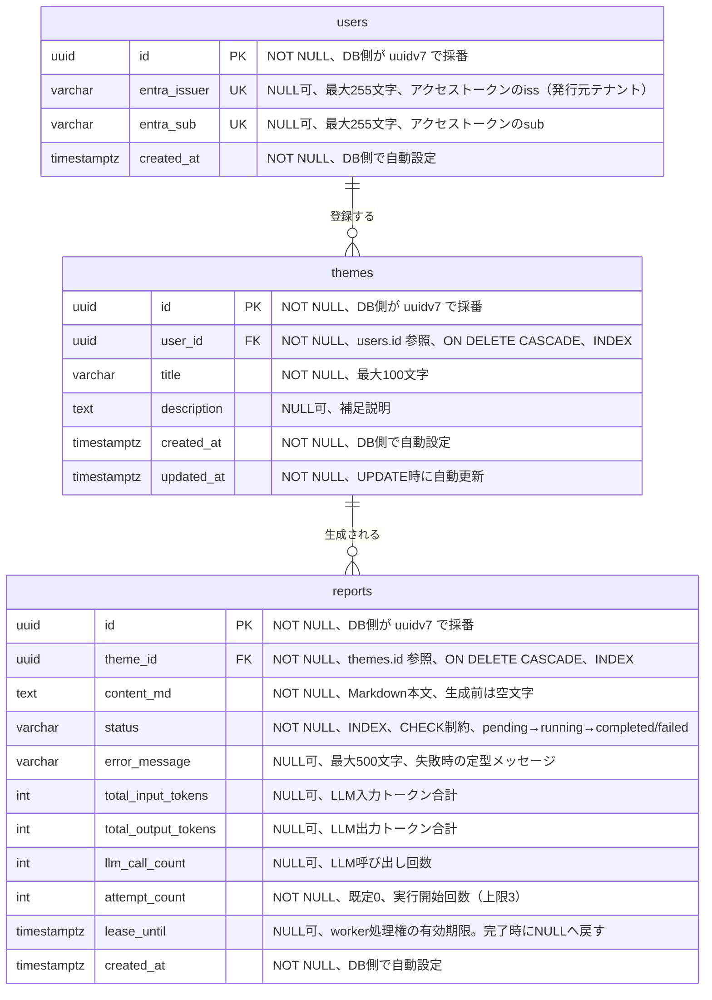

# Entity Relationship Diagram

## 補足

- `users` は `(entra_issuer, entra_sub)` の組で一意（`uq_users_entra_identity`）。Microsoft Entra External ID で初めてAPIにアクセスしたときに作成される。メールアドレスは保存しない
- `reports.attempt_count` と `lease_until` は、Queue の重複配送やworkerの停止に備えた処理権の管理に使う。条件付きUPDATEで処理権を取り、保存時は取得時の `attempt_count` と一致する場合だけ書き込む
