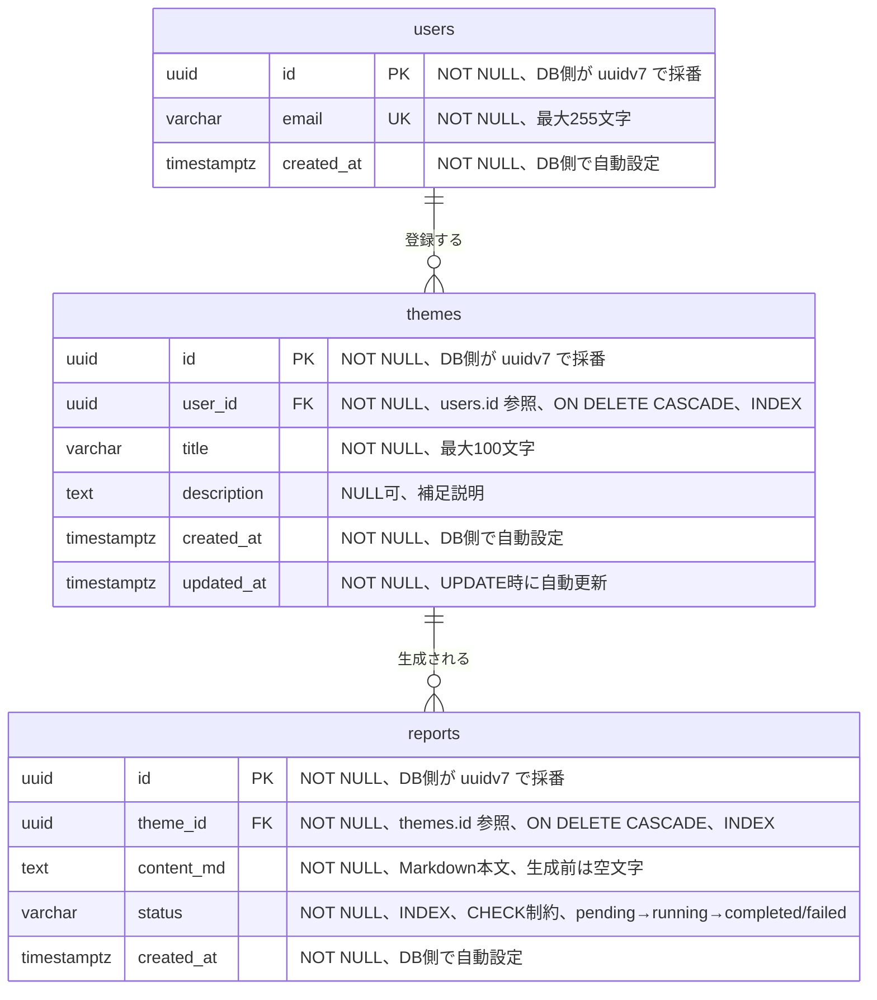

# Entity Relationship Diagram

```mermaid
erDiagram
    users ||--o{ themes : "登録する"
    themes ||--o{ reports : "生成される"

    users {
        uuid id PK "NOT NULL、DB側が uuidv7 で採番"
        varchar email UK "NOT NULL、最大255文字"
        timestamptz created_at "NOT NULL、DB側で自動設定"
    }

    themes {
        uuid id PK "NOT NULL、DB側が uuidv7 で採番"
        uuid user_id FK "NOT NULL、users.id 参照、ON DELETE CASCADE、INDEX"
        varchar title "NOT NULL、最大100文字"
        text description "NULL可、補足説明"
        timestamptz created_at "NOT NULL、DB側で自動設定"
        timestamptz updated_at "NOT NULL、UPDATE時に自動更新"
    }

    reports {
        uuid id PK "NOT NULL、DB側が uuidv7 で採番"
        uuid theme_id FK "NOT NULL、themes.id 参照、ON DELETE CASCADE、INDEX"
        text content_md "NOT NULL、Markdown本文、生成前は空文字"
        varchar status "NOT NULL、INDEX、CHECK制約、pending→running→completed/failed"
        timestamptz created_at "NOT NULL、DB側で自動設定"
    }
```
